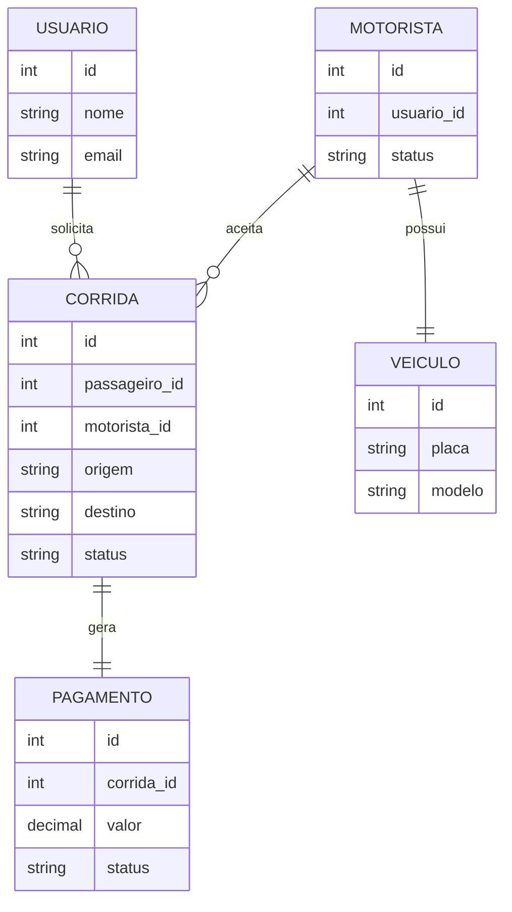
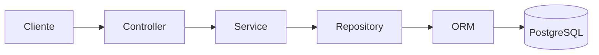
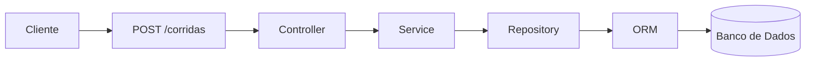
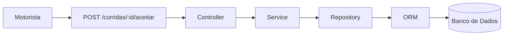
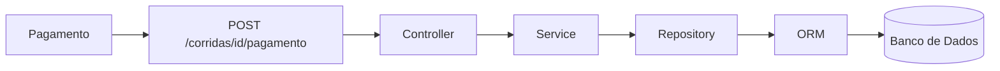
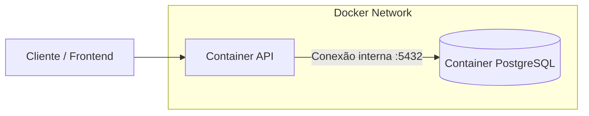

# Entrega 004 - Dos Casos de Uso à Implementação do Seu Próprio Sistema  

Aluno(a): Emilly Pessutti  
Disciplina: Desenvolvimento de Sistemas Corporativos
---

# 1. Apresentação do Sistema

## Nome do Sistema
Plataforma de Caronas e Mobilidade Urbana

## Problema que o sistema resolve
Dificuldade de deslocamento urbano, custo elevado de transporte e falta de integração entre passageiros e motoristas.

## Público-alvo
- Passageiros que precisam de transporte  
- Motoristas que desejam oferecer corridas  
- Administrador do sistema  

## Objetivo principal
Conectar passageiros e motoristas para realização de corridas, permitindo solicitação, aceite, execução e pagamento.

## Domínio do sistema
Sistema de mobilidade urbana com gerenciamento de corridas, usuários, motoristas, pagamentos e avaliações.

---

# 2. Levantamento Inicial dos Casos de Uso Candidatos

| Caso de Uso         | Características              | Avaliação Técnica          | Veredito    |
| ------------------- | ---------------------------- | -------------------------- | ----------- |
| UC01 - Cadastrar conta     | Cadastro simples             | Poucas regras              | Descartado  |
| UC02 - Autenticar usuário  | Apenas valida login          | Sem persistência relevante | Descartado  |
| UC03 - Solicitar corrida   | Multientidade e regras       | Fluxo central              | Selecionado |
| UC04 - Calcular valor      | Apenas cálculo               | Sem persistência           | Parcial     |
| UC05 - Aceitar corrida     | Atualiza corrida e motorista | Multientidade              | Selecionado |
| UC06 - Iniciar corrida     | Apenas mudança status        | Dependente                 | Parcial     |
| UC07 - Finalizar corrida   | Importante                   | Depende do pagamento       | Dependente  |
| UC08 - Processar pagamento | Regras e persistência        | Fluxo crítico              | Selecionado |
| UC09 - Cancelar corrida    | Simples                      | Poucas regras              | Futuro      |
| UC10 - Avaliar corrida     | Pós fluxo                    | Não central                | Futuro      |
 

---

# 3. Casos de Uso Selecionados

- UC03 – Solicitar corrida  
- UC05 – Aceitar corrida  
- UC08 – Processar pagamento  

---

# 4. Rastreabilidade

UC03 – Solicitar corrida
→ RN01 Passageiro deve estar autenticado
→ POST /corridas
→ Entidades: Usuário, Corrida, Localização

UC05 – Aceitar corrida
→ RN02 Motorista deve estar disponível
→ RN03 Corrida só pode ser aceita por um motorista
→ POST /corridas/{id}/aceitar
→ Entidades: Motorista, Corrida, Veículo

UC08 – Processar pagamento
→ RN04 Pagamento apenas após corrida finalizada
→ RN05 Valor calculado pela corrida
→ POST /corridas/{id}/pagamento
→ Entidades: Corrida, Pagamento, Usuário

---

# 5. Definição da API

## UC03 – Solicitar Corrida

| Elemento                 | Descrição                                |
| ------------------------ | ---------------------------------------- |
| Rota                     | /corridas                                |
| Método HTTP              | POST                                     |
| Objetivo do endpoint     | Criar uma nova solicitação de corrida    |
| Dados de entrada         | passageiroId, origem, destino            |
| Dados de saída (sucesso) | 201 Created + dados da corrida criada    |
| Erros esperados          | 400 dados inválidos, 404 passageiro não encontrado                          |

Entrada
```json
{
  "passageiroId": 1,
  "origem": {
    "latitude": -25.7402,
    "longitude": -53.0573
  },
  "destino": {
    "latitude": -25.7460,
    "longitude": -53.0601
  }
}
```

Saída (201)
```json
{
  "id": 10,
  "status": "solicitada",
  "valorEstimado": 25.50
}
```

---

## UC05 – Aceitar Corrida

| Elemento                 | Descrição                                                         |
| ------------------------ | ----------------------------------------------------------------- |
| Rota                     | /corridas/{id}/aceitar                                            |
| Método HTTP              | POST                                                              |
| Objetivo do endpoint     | Permitir que motorista aceite uma corrida disponível              |
| Dados de entrada         | motoristaId, id da corrida                                        |
| Dados de saída (sucesso) | 200 OK + corrida atualizada                                       |
| Erros esperados          | 404 corrida não encontrada, 409 corrida já aceita, 400 dados inválidos |

Entrada
```json
{
  "motoristaId": 5
}
```

Saída (200 OK)
```json
{
  "id": 10,
  "status": "aceita",
  "motoristaId": 5
}
```

---

## UC08 – Processar Pagamento

| Elemento                 | Descrição                                       |
| ------------------------ | ----------------------------------------------- |
| Rota                     | /corridas/{id}/pagamento                        |
| Método HTTP              | POST                                            |
| Objetivo do endpoint     | Processar pagamento após finalização da corrida |
| Dados de entrada         | formaPagamento, id da corrida                   |
| Dados de saída (sucesso) | 200 OK + pagamento realizado                    |
| Erros esperados          | 404 corrida não encontrada, 409 corrida não finalizada, 400 dados inválidos     |

Entrada
```json
{
  "formaPagamento": "cartao"
}
```

Saída (200 OK)
```json
{
  "status": "pago",
  "valor": 32.90
}
```
---

# 6. Modelo Conceitual de Persistência



---

# 7. Estrutura do Backend



---

# 8. Fluxo Técnico

## UC03 — Solicitar Corrida



---

## UC05 — Aceitar Corrida



---

## UC08 — Processar Pagamento



---

# 9. Visão de Implantação

A aplicação será executada utilizando containers Docker, separando a API e o banco de dados em ambientes isolados.


### **Container da API**

Responsável por executar a aplicação backend da plataforma de caronas.
Este container contém:

- código da API
- dependências do projeto
- controllers, services e repositories
- configuração de conexão com banco

A API expõe os endpoints HTTP para consumo do sistema.

### **Container do Banco de Dados**

Responsável por executar o PostgreSQL de forma isolada.
Este container armazena:

- usuários
- corridas
- motoristas
- veículos
- pagamentos

O banco é persistido em volume Docker para manter os dados.

### **Comunicação entre Containers**

Os containers se comunicam através de uma rede interna do Docker.

O container da API acessa o banco utilizando:

- host: postgres
- porta: 5432

Essa comunicação não é exposta externamente.

Fluxo:
API Container → PostgreSQL Container

### **Papel do Docker**

O Docker é utilizado para:

**Isolamento**
Cada serviço roda em seu próprio container

**Reprodutibilidade**
O sistema roda igual em qualquer máquina

**Portabilidade**
Pode ser executado em desenvolvimento ou produção

**Facilidade de execução**
Um único comando sobe toda infraestrutura

---

# 10. Conclusão

Os três casos selecionados representam o núcleo do sistema de mobilidade urbana, cobrindo desde a solicitação da corrida até o pagamento final.

O documento define:
- contratos de API
- entidades
- fluxo técnico
- arquitetura backend
- visão de implantação

Este artefato servirá como base para implementação do backend.
